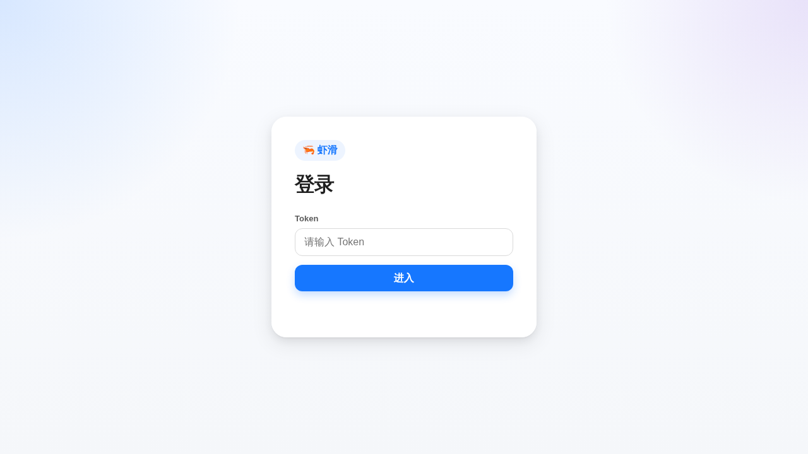
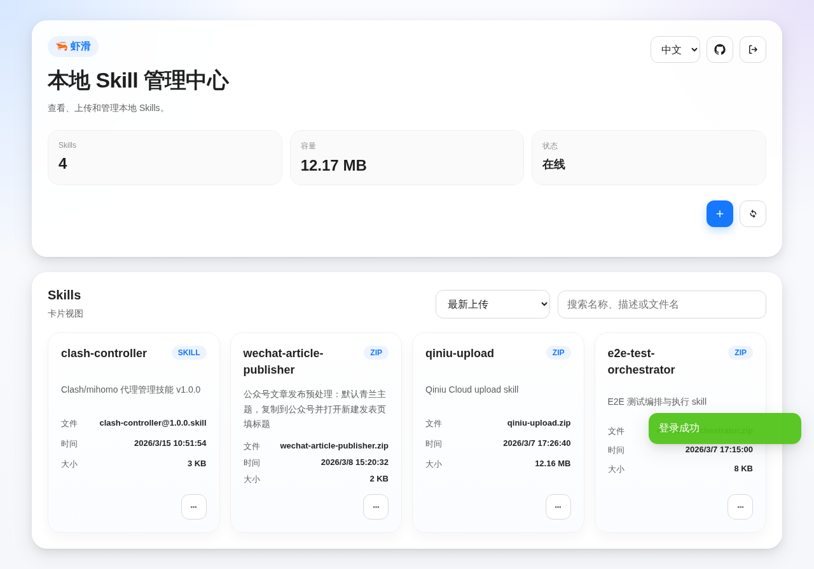

# 虾滑（Claw Skill Nest）

一个轻量、好看的本地 Skill 管理中心，用来上传、浏览、下载和删除私有 Skills。

## 截图

### 登录页



### 主界面



## 当前特性

- Express 后端 + 静态前端页面
- Token 登录校验（基于 `X-API-Key`）
- 中英文切换
- GitHub 仓库快捷入口
- Skill 卡片式展示
- 搜索与排序
- 独立上传页
- 支持下载、删除等基础操作
- 支持 `.skill` 和 `.zip` 文件
- 本地磁盘存储 + JSON 元数据持久化

## 技术栈

- Node.js
- Express
- Multer
- 原生 HTML / CSS / JavaScript
- Playwright（E2E 测试）
- Supertest（API 测试）

## 快速开始

### 本地运行

```bash
cd claw-skill-nest
npm install
# 先编辑 config.json 中的端口、Token、数据目录
npm start
```

默认访问：

```text
http://localhost:17890
```

### 一键脚本

```bash
cd claw-skill-nest
./start.sh
./stop.sh
```

说明：

- `start.sh` 优先使用 Docker Compose
- 若 Docker Compose 不可用，会自动回退到 Node.js 模式
- `stop.sh` 会尝试停止 Docker 服务和本地 Node 进程

### Docker Compose 运行

```bash
docker-compose up -d
```

服务默认启动在：

```text
http://localhost:17890
```

数据会保存到持久卷 `claw-skill-nest_data`。

## 配置

默认读取根目录下的 `config.json`：

```json
{
  "port": 17890,
  "apiKey": "change-this-to-a-strong-key",
  "dataDir": "data"
}
```

也支持启动时手动指定配置文件：

```bash
node index.js --config=./config.json
```

兼容环境变量回退：

- `PORT`
- `API_KEY`
- `DATA_DIR`

## API

### 鉴权

所有 `/api` 端点都需要携带请求头：

```http
X-API-Key: <your-token>
```

### 接口列表

- `GET /api/auth/verify`：校验 Token
- `GET /api/skills`：获取 Skill 列表
- `POST /api/skills/upload`：上传 Skill 文件
- `GET /api/skills/:id`：获取单个 Skill 信息
- `DELETE /api/skills/:id`：删除 Skill
- `GET /api/skills/:id/download`：下载 Skill 文件

## 测试

运行全部测试：

```bash
npm test
```

分别运行：

```bash
npm run test:api
npm run test:e2e
```

## 项目定位

虾滑不是公共 Skill 市场，更偏向于：

- 本地私有 Skill 仓库
- 家庭 / 小团队内部使用
- OpenClaw 生态下的轻量管理面板

如果你想继续扩展，比较适合往这些方向走：

- 用户体系 / 真正会话登录
- 标签与分类
- Skill 详情页
- 版本管理
- 远程仓库同步
